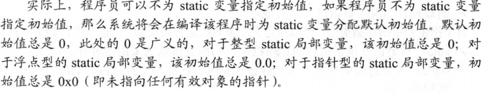
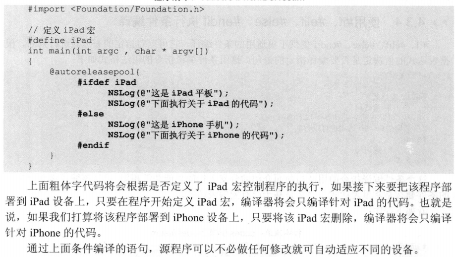
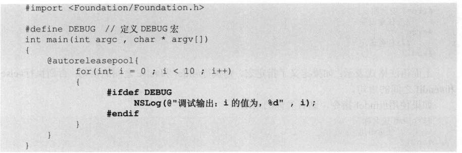

## 4 C语言特性

### 4.1 函数

#### 4.1.1 函数定义

> 如果没有声明返回值类型，默认返回int

#### 4.1.2 函数声明

> 当函数定义在函数调用的后面或者其它文件，需要函数声明来告诉编译器函数的返回类型和形参；函数声明有两种形式：
>
> - 声明返回值、函数名、形参类型
>
>
> - 声明返回值、函数名、形参类型、形参名

#### 4.1.3 函数的参数传递机制

> objective-c中函数传递只有**值传递**，即将实际参数值的副本传入函数，参数本身不受任何影响

> 当形参是指针类型变量时，同样是值传递，**传递的副本是指针变量的值**，而指针变量的值是对象地址，所以最后的结果是函数内部改变了对象的值

#### 4.1.4 递归函数

> 递归一定要向已知方向递归

#### 4.1.5 数组作为函数参数

> 数组元素作为形参与普通变量无区别
>
> 数组变量作为形参：
>
> - 必须指定数组类型的形参，可以指定长度或者不指定；多维数组只有最左边维数可忽略
> - 声明函数的形参类型必须和传入的实参类型一致

#### 4.1.6 内部函数与外部函数

> 函数本质是全局的，但从函数是否可以被其它源文件调用出发，可以将函数分为：
>
> - 内部函数：static修饰定义，只能被当前源文件使用
> - 外部函数：extern或不使用修饰定义，可以被任意源文件使用
>
> 内部函数具有更好的内聚性，避免多源函数重名函数

```objective-c
//PrintFounctionLib.m
#import<Foundation/Foundation.h>
extern void printRect(int height, int width){}
void printTriangle(int height){}
```

```objective-c
//PrintTest.m
//声明外部函数
void printRect(int,int);
void printTriangle(int);

int main(int argc, char *argv[]){
  @autoreleasepool{
    printRect(5,10);
    printTriangle(7);
  }
}
```

> 上面没有使用import导入PrintFounctionLib.m文件，使用声明的方式
>
> 所以需要将两个文件先编译，再链接
>
> `clang -fobjc-arc -framework Foundation PrintFounction.m PrintTest.m`

> 当使用import导入时，实际是将PrintFounctionLib.m文件的代码放在PrintTest.m前面，所以即使使用static修饰，也可以被PrintTest.m使用
>
> 编译时，只需要编译PrintTest.m

> 使用函数时，不要求函数一定要在被调用之前定义
>
> 编译器在处理到某个未知类型的函数时，会为其创建一个隐式声明，并假设该函数返回值类型为int

### 4.2 局部变量和全局变量

> 定义在函数内部的是局部变量，函数外部的是全局变量
>
> 全局变量的作用域：定义该变量的位置开始到该源程序结束

#### 4.2.1 局部变量

- 定义形式
  - 形参
  - 函数局部变量：从定义到函数结束
  - 代码块局部变量：从定义到代码块结束

> 如果对非静态局部变量不赋初始值，它们的值不确定（通常是0）
>
> 因为每次调用函数都会为局部变量重新分配内存

#### 4.2.2 全局变量

> 在一个函数内部，局部变量和全局变量重名，全局变量失效

> `extern 类型 全局变量名`：声明（在函数内部也可以）定义在函数后面的全局变量

#### 4.2.3 外部全局变量和内部全局变量

> 用static关键字修饰变量，使得变量不能被其它源程序访问
>
> `extern 类型 变量名`：声明外部全局变量

#### 4.2.4 动态存储和静态存储

> 动态：运行期间根据需要动态分配内存
>
> 静态：运行开始就分配固定内存

- C内存分为：

- 程序区

- 静态存储区--程序结束才释放变量内存

  - 内部、外部全局变量
  - static修饰的局部变量

- 动态存储区--函数内非static变量每次调用重新分配内存，每次函数结束释放

  - 形参变量
  - 非static局部变量
  - 函数执行的现场数据和返回地址

  ​

- 存储类别：

  - auto：自动存储机制，局部变量默认采用（即动态存储）
  - static：指定变量存放到静态存储区
    - 静态局部变量可以不使用递归函数实现阶乘运算
    - 静态局部变量只能在函数内部使用
    - 当需要保留上次调用结束时的值
    - 希望变量只能被初始化一次，之后只是引用

  

  - register：指定变量存放到寄存器
    - 避免CPU频繁读取内存，提升性能
    - 实际上寄存器数量有限，而且有些系统将register局部变量当做auto
  - extern：声明外部变量
    - 外部变量都是放在静态存储区


### 4.3 预处理

> 预处理命令必须以#开头
>
> 通常位于程序开头

#### 4.3.1 #define、#undef执行宏定义

- define：为字符串起名字，一般所有字母大写

  - `#define YES 1.1311`
  - 宏定义不是C语句，不能进行赋值，不能使用分号结束
  - 宏定义不是变量、常量，不要进行赋值
  - 编译器处理宏定义只是“查找、替换”，将宏名字替换为对应的字符串
  - 作用域：定义到源文件结束
    - `undef 宏名称`可以提前结束宏定义

- 嵌套宏定义：

  > `#define PI 3.1415926`
  >
  > `#define TWO_PI PI*2`

#### 4.3.2 带参数的宏定义

> `#define 宏名称（参数列表） 字符串`

> ```objective-c
> #define PI 3.1415926
> #define GIRTH(r) PI*2*r
> #define AREA(r) PI*r*r
> ```

> 由于编译器只是简单地对宏进行查找、替换
>
> AREA(10+2) --> PI*10+2 *10+2

> 所以对于带参数的宏定义，应该用括号将参数括起来

> ```objective-c
> #define PI 3.1415926
> #define GIRTH(r) (PI*2*(r))
> #define AREA(r) (PI*(r)*(r))
> ```

#### 4.3.3 #ifdef、#ifndef、#else、#endif执行条件编译

> 程序使用条件编译，根据机器环境进行选择性的编译

- 如果定义了指定的宏，执行#ifdef和#endif之间的语句

  ```objective-c
  #ifdef 宏名称
  //任意语句
  #endif
  ```


- 如果定义了指定的宏，执行#ifdef和#else之间的语句，否则执行#else和#endif之间的语句

  ```objective-c
  #ifdef 宏名称
  //任意语句
  #else
  //任意语句
  #endif
  ```


- 对于#ifndef，和#ifdef类似，只是条件是“如果**没有定义**指定的宏”



-  下面的例子可以控制是否输出调试信息，在需要发布应用时只需删除宏即可

  > 也可以在源代码中不定义宏，而是在编译时使用-D定义宏
  >
  > `clang -fobjc-arc -framework Foundation -D DEBUG xxxx.m`

#### 4.3.4 #if、#elif、#else、#endif执行条件编译

- 该条件编译指令与之前的类似，只是条件要么是常量表达式，要么是宏表达式

  ```objective-c
  #if 表达式
  //任意语句
  #elif 表达式
  //表达式
  ...//可以有零或多个#elif语句
  //最后的#else语句可省略
  #else
  //任意语句
  #endif
  ```


- **为什么不用普通分支语句代替条件编译指令**

> 使用条件编译，是编译器执行编译之前的预处理
>
> 不符合条件的语句不会编译，也不会生成执行性指令

> 而普通的分支语句也能达到条件编译的效果，但会编译成执行性代码，在运行时根据条件决定执行哪些语句
>
> 这使得生成的文件更大、执行效率更低（运行时判断）

#### 4.3.5 #include、#import

> 文件导入可重复使用的宏定义、通用函数

- include指令就是将源代码插入当前代码的指定位置
  - 需要程序员自己判断重复导入问题	
- import指令和include类似，但是可以自行解决重复导入
  - 对于导入系统源文件，使用**<u><></u>**包含文件名，表示在特定的系统头文件路径搜索被导入的文件
  - 导入自定义的源文件，使用**双引号**包含文件名，告诉预处理程序将会到一个或多个路径下搜索源文件（通常首先搜索当前文件所在路径，可以在xcode中设置搜索路径）

### 4.4 指针

- 访问变量的两种方式

> 通过变量访问值--直接访问
>
> 去变量的存储位置取值--间接访问

> 变量的内存地址就是该变量的**指针**
>
> 保存内存地址（指针）的变量就是**指针变量**

> 定义指针变量时，最好将*紧跟“类型”后

- 两个基本的指针运算符
  - &：**取地址运算符**，单目运算符，紧跟一个变量，读取该变量的内存地址
  - *：**取变量运算符**，单目运算符，通常紧跟一个指针变量，用于读取该指针变量所指的变量；如果紧跟一个内存地址（指针），读取该地址所指的变量

- 指针变量的两个规则
  - 必须用*来标识定义
  - 所有指针变量必须先声明后使用，类型必须相同

### 4.5 指针与数组

> 指向数组的指针：指针变量指向数组的第一个元素
>
> 数组变量的本质是一个**指针常量**，保存了指向第一个数组元素的指针

- 获取数组首地址（简称数组地址）的方式
  - int *p = &arr[0];
  - int *p = arr;  这种方式较常用

#### 4.5.1 指针运算

> C语言不允许直接将整数值赋值给指针变量，这会使得指针乱指

- 指针变量赋值方式
  - p = &a
  - p = &arr[0];
  - p = arr;
  - p = pt;  将指针变量pt保存的地址赋值给p
- 指针变量支持的运算
  - **+/-** 一个整数n，代表该指针的地址加减（n*变量大小）个字节
    - 如int* p，p保存的地址是0x00010004; p+3代表的地址是0x00010010
    - 如char* p，p保存的地址是0x00020001; p+5代表的地址是0x00020006
  - 当两个指针变量指向同一个数组的元素时，可以相减，返回相差的元素个数
  - 当两个指针变量指向同一个数组的元素时，可以比较大小，指向前面数组元素的指针变量较小

> arr+i 与 &arr[i]等价
>
> *(arr+i)与arr[i]等价

- 因为数组变量保存的是数组首地址，且是常量；对其进行赋值、改变会发生错误

#### 4.5.2 数组变量作为函数参数

> 数组变量本质是指针常量，将其作为函数参数，其实是将指针变量作为参数

#### 4.5.3 多维数组

> 对于二维数组
>
> 注意arr和arr[0]包含的地址相同，arr指向数组首地址
>
> arr[0]（*arr）代表二维数组第一个元素，代表第一个数组的首地址

### 4.6 字符串与指针

#### 4.6.1 字符指针表示字符串

> C语言没有字符串类型，在底层用字符数组来保存字符串
>
> ```objective-c
> char* str;
> str = "i love iOS";
> str += 7;
> NSLog(@"%s",str);
> ```

> 输出--**iOS**
>
> 程序使用%s输出字符指针时，系统会自动输出紧跟该字符指针所指元素的每个元素，直到遇到**\0**

#### 4.6.2 字符指针作为函数参数

- 字符指针变量和字符数组区别

  - 字符数组底层存放了所有字符，每个字符对应一个数组元素；字符指针指向字符数组时，只是存放了首地址

  - 字符数组只能在定义时赋值整个字符串

    - ```objective-c
      char[100] str;//语法错误
      char str[100];//正确,str底层100个数组元素已经初始化为\0
      str = "www.daffa.org";//数组变量不能重复赋值
      ```

    - 如果是之后单独为个别元素赋值，是允许的

  - 字符指针可以重复赋值

  - 定义字符数组时，程序会为每个元素分配内存空间；定义字符指针变量时，所指向的内存单元不确定

    - ```objective-c
      char str[100];
      scanf("%s",str);//正确,输入的字符串长度超过100也能存储
      char* pt;
      scanf("%s",pt);//编译不会出错，运行有风险
      ```


### 4.7 函数与指针

#### 4.7.1 函数指针变量调用函数

- 定义函数指针
  - `函数返回值类型 （* 指针变量名）（）；`
  - 将已有的函数入口赋值：`fnpt = avg；`
- 赋值
  - C允许将任何已有的函数赋值给函数指针变量，同一个函数指针变量在不同时间可 指向不同函数
  - 赋值只需给出函数名
  - 用函数指针变量调用函数
    - `（*函数指针变量）（参数）；`


- 注意
  - 函数指针变量比较大小、加减整数、互减都没有意义

#### 4.7.2 函数指针变量作为参数

> 某个函数的计算逻辑能确定，但是处理逻辑无法确定，某些代码需要动态改变
>
> 需要在调用函数时动态传入函数参数，而动态改变代码

#### 4.7.3 返回指针的函数

- 保证函数返回的指针有效
  - 若函数返回的指针指向被调用函数中的局部变量，该变量应用static修饰
  - 让函数返回的指针指向暂时不会被释放的数据
    - 如，可以指向main函数中的变量

### 4.8 指针数组和指向指针的指针

#### 4.8.1 指针数组和main()参数

- 指针数组语法
  - `类型* 数组变量[长度]`：[]优先级更高，数组变量先与[]结合成数组，“类型*”指定元素类型
  - `类型 （*变量名）[长度]`: 定义的是指向一维数组的指针变量 

- main参数
  - **在控制台输入参数时，若参数包含空格，应该在空格前添加\，不然会被识别输入了多个参数**

#### 4.8.2 指向指针变量的指针

> `类型** 变量名`

### 4.9 结构体

#### 4.9.1 定义

> `struct 结构体类型名{//成员列表}`

> ```objective-c
> struct rect{
>   int x;
>   int y;
>   int width;
>   int height;
> }
> ```

- 定义结构体变量形式

  - 先定义结构体类型，再定义结构体变量

    - `struct 结构体类型名 变量名;`
    - 可以使用#define简化
      - `#define POINT struct point`
    - 可以使用typedef为已有的结构体类型定义新名称

  - 同时定义结构体类型和变量

    - ```objective-c
      struct 结构体类型名{
        //成员列表
      }结构体变量1，结构体变量2...;
      ```

    - 若之后无需再次使用该结构体类型，可以省略“**结构体类型名**”

#### 4.9.2 typedef

> 为已有的数据类型另起名字

> `typedef 已有类型 新名称;`
>
> `typedef int Counter;`	`Counter i,j;`

> 为结构体、枚举等简化名称
>
> ```objective-c
> struct point{
>   int x;
>   int y;
> };
> typedef struct point FKPoint;
> enum season{spring,summer,fall,winter};
> typedef enum season FKSeason;
> ```

#### 4.9.3 初始化结构体变量

> `结构体变量.成员名`访问某个成员

> 只有当定义结构体类型或者使用typedef定义的别名的同时定义结构体变量，才能进行整体初始化
>
> 之后只能单独为成员赋值

> ```objective-c
> struct rect{
>   int x;
>   int y;
> } rect1 = {1,2}; //YES
>
> rect1 = {2,3}; //NO
>
> typedef struct rect FKRect;
> FKRect rect2 = {44}; //YES
> rect2 = {2}; //NO
> rect2.x = 2; //YES
> ```

#### 4.9.4 结构体数组

> 和结构体变量基本类似，同样只能在定义时整体赋值

> ```objective-c
> struct rect{
>   int x;
>   int y;
> } rect1[] = ({1,2},{3,4}); //YES
>
> typedef struct rect FKRect;
> FKRect rect2[] = {{44},{4,5}}; //YES
> rect2[0] = {5,7}; //NO
> rect2[0].x = 3; //YES
> ```

### 4.10 块

#### 4.10.1 基本语法

> 块变量与函数指针很相似，块像一个匿名函数

> ```objective-c
> ^[块返回值类型](形参类型1 形参1，形参类型2 形参2，...){
>   //块执行体
> }
> ```

- 定义块与定义函数的区别
  - 定义块必须以^开头
  - 定义块的返回值类型可以省略（一般都省略）
  - 定义块无须指定名字
  - 块不带参数最好用void作为占位符
- 要多次调用已经定义的块，可以用快变量存储
  - 块变量语法，无须声明形参名
    - `块返回值类型 (^快变量名)(形参类型1，形参类型2，...);`


- ```
  //不带参数、无返回值的块
  void (^printStr)(void) = ^(void){
    NSLog(@"....");
  };
  printStr();
  //带参数、有返回值的块
  double (^hypot)(double,double) = ^(double num1,double num2){
    return sqrt(num1*num1 + num2*num2);
  };
  NSLog(@"%g",hypoy(3,4));
  ```

#### 4.10.2 块与局部变量

> 块无法修改局部变量，可以读取
>
> 在定义块时，系统就已经将局部变量的值保存在块中，所以即使之后局部变量值改变，块中局部变量的值还是不变

> `__block int my = 20;`
>
> 用__block修饰变量后，块即可修改，且在执行时才访问、获取

#### 4.10.3 直接使用块作为参数

> 块只能作为函数、方法的最后一个参数，每个函数、方法最多只能指定一个块类型参数

#### 4.10.4 使用typedef定义块变量类型

> `typedef 块返回值类型 (^块变量类型名)(形参类型1，形参类型2，...);`
>
> `typedef void (^FKPrintBlock)(NSString*);`

- 块变量类型用途
  - 复用，重复定义多个块变量
  - 定义函数参数，定义带块参数的函数