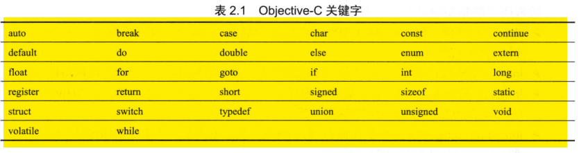
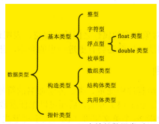
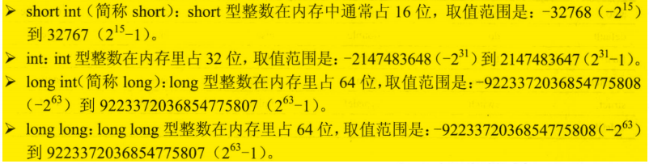
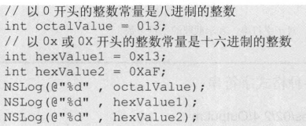
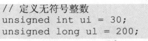
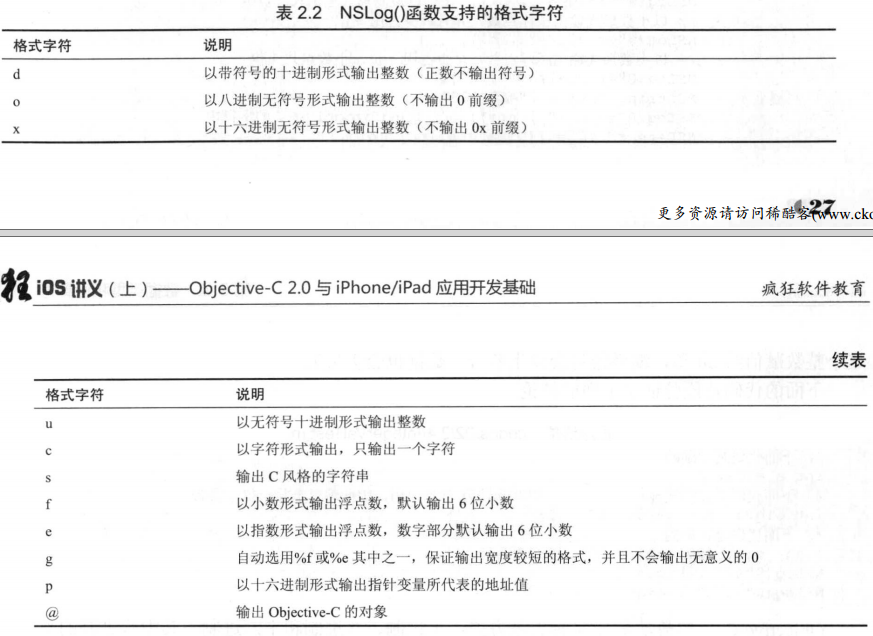
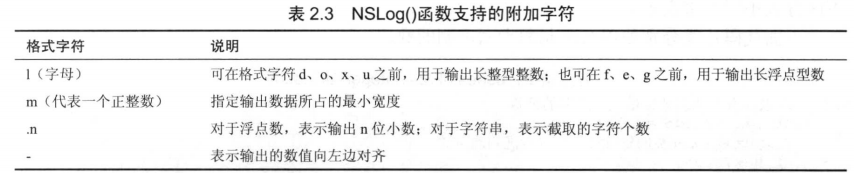
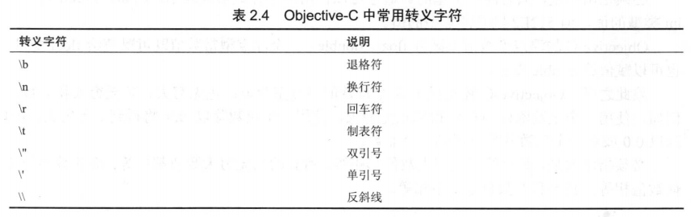

# objective-c学习笔记

## 1 简介

- **框架**：系列函数、类等程序单元的集合，系统地提供某一方面的功能

- **入口函数**：`int main(int argc,char* argv[])`

- **编译器**：早期使用GCC，现在使用LLVM

  > LLVM语法： `clang -fobjc-arc -framework<需要依赖的框架> <源程序> -o  <生成文件>` 
  >
  > `-fobjc-arc`用于启用ARC（自动计数功能），`-framework`指定依赖框架
  >
  > 如一般的HelloWrold程序，由于依赖了Foundation框架，使用如下语法：`clang -fobjc-arc -famework Foundation HelloWorld.m -o hello.out`
  >
  > 该命令生成一个`hello.out`文件，`./hello.out`命令运行生成文件

- **组**：是xcode用逻辑方法将文件分为不同的逻辑组，不同于磁盘中的文件夹

## 2 数据类型和运算符

> **基本数据类型：**
>
> ​	**数值型：**整型、字符型、浮点型（float、double）、枚举型，可以进行类型转换（自动或强制）
>
> ​	**布尔型**
>
> **构造数据类型：**数组类型、结构体类型、共用体类型
>
> **指针数据类型**：包括较特殊的空类型，nil是空类型变量唯一的值
>
> **运算符：**位运算符、比较运算符、逻辑运算符

### 2.1 注释

> 注释最好占到源代码的1/3

### 2.2 标识符和变量

#### 2.2.1 分隔符

> **分号-；、{}、[]、()、、空格、圆点-.**

#### 2.2.2 标识符规则

#### 2.2.3 关键字 

### 2.3 数据类型分类

 

### 2.4 基本数据类型

#### 2.4.1 整型  

> objective-c中满足long long >= long >= int >= short
>
> 所以在64位mac系统中，short占2字节、int占4字节、long int占8字节、long long占8字节
>
> 在iOS系统中，long int只占4字节

- 整型常量有十进制、八进制、十六进制

  > 八进制以0开头，十六进制以0x或者0X开头（10～15分别是a～f，不区分大小写） 


- unsigned关键字将四种整型变量变成无符号型，首位不是符号位而是数值位，所以无符号整型比同类普通整型最大值大一倍

   


#### 2.4.2 NSLog及格式字符





```objective-c
int a = 56;
NSLog(@"%9d",a);//输出整数至少占9位
NSLog(@"%-9d",a);//输出整数至少占9位，左对齐
double dl = 2.3;
NSLog(@"%f",dl);//小数形式输出，且小数点后6位
NSLog(@"%e",dl);//指数形式，小数点后6位
//2.300000e+00
NSLog(@"%g",dl);//最短宽度输出浮点数
//2.3
NSLog(@"%9f",dl);//小数形式输出，至少占9位
// 2.300000
NSLog(@"9.4f",dl);//至少占9位，小数点后4位;字符串.n表示截取字符个数
//   2.3000
```

#### 2.4.3 字符型

> 字符型表示单个字符，且必须用单引号(')包含
>
> 每个字符只占一个字节，所以单个objective-c字符不支持中文字符

> 字符常量通过两种形式表示：
>
> - 通过单个字符：如'A', '9'
>
> - 转义字符表示特殊字符常量：如'\n'、'\t'
>
>   

> char类型的值可直接作为8位无符号整数使用，取值范围0~255
>
> 如果把0~255范围内的一个整数赋值给char类型变量，会被当成对应char类型处理