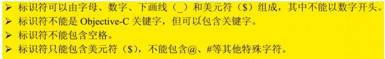

# objective-c学习笔记

## 1 简介

- **框架**：系列函数、类等程序单元的集合，系统地提供某一方面的功能

- **入口函数**：`int main(int argc,char* argv[])`

- **编译器**：早期使用GCC，现在使用LLVM

  > LLVM语法： `clang -fobjc-arc -framework<需要依赖的框架> <源程序> -o  <生成文件>` 
  >
  > `-fobjc-arc`用于启用ARC（自动计数功能），`-framework`指定依赖框架
  >
  > 如一般的HelloWrold程序，由于依赖了Foundation框架，使用如下语法：`clang -fobjc-arc -famework Foundation HelloWorld.m -o hello.out`
  >
  > 该命令生成一个`hello.out`文件，`./hello.out`命令运行生成文件

- **组**：是xcode用逻辑方法将文件分为不同的逻辑组，不同于磁盘中的文件夹

------


## 2 数据类型和运算符

> **基本数据类型：**
>
> ​	**数值型：**整型、字符型、浮点型（float、double）、枚举型，可以进行类型转换（自动或强制）
>
> ​	**布尔型**
>
> **构造数据类型：**数组类型、结构体类型、共用体类型
>
> **指针数据类型**：包括较特殊的空类型，nil是空类型变量唯一的值
>
> **运算符：**位运算符、比较运算符、逻辑运算符

------

### 2.1 注释

> 注释最好占到源代码的1/3

------

### 2.2 标识符和变量

#### 2.2.1 分隔符

> **分号-；、{}、[]、()、、空格、圆点-.**

#### 2.2.2 标识符规则

#### 2.2.3 关键字 

------

### 2.3 数据类型分类

 

------

### 2.4 基本数据类型

#### 2.4.1 整型  

> objective-c中满足long long >= long >= int >= short
>
> 所以在64位mac系统中，short占2字节、int占4字节、long int占8字节、long long占8字节
>
> 在iOS系统中，long int只占4字节

- 整型常量有十进制、八进制、十六进制

  > 八进制以0开头，十六进制以0x或者0X开头（10～15分别是a～f，不区分大小写） 


- unsigned关键字将四种整型变量变成无符号型，首位不是符号位而是数值位，所以无符号整型比同类普通整型最大值大一倍

   


#### 2.4.2 NSLog及格式字符


```objective-c
int a = 56;
NSLog(@"%9d",a);//输出整数至少占9位
NSLog(@"%-9d",a);//输出整数至少占9位，左对齐
double dl = 2.3;
NSLog(@"%f",dl);//小数形式输出，且小数点后6位
NSLog(@"%e",dl);//指数形式，小数点后6位
//2.300000e+00
NSLog(@"%g",dl);//最短宽度输出浮点数
//2.3
NSLog(@"%9f",dl);//小数形式输出，至少占9位
// 2.300000
NSLog(@"9.4f",dl);//至少占9位，小数点后4位;字符串.n表示截取字符个数
//   2.3000
```

#### 2.4.3 字符型

> 字符型表示单个字符，且必须用单引号(')包含
>
> 每个字符只占一个字节，所以单个objective-c字符不支持中文字符

> 字符常量通过两种形式表示：
>
> - 通过单个字符：如'A', '9'
>
> - 转义字符表示特殊字符常量：如'\n'、'\t'
>
>   

> char类型的值可直接作为8位无符号整数使用，取值范围0~255
>
> 如果把0~255范围内的一个整数赋值给char类型变量，会被当成对应char类型处理

#### 2.4.4 浮点型 

#### 2.4.5 枚举型

> 枚举列出来的值称为枚举值、枚举常量、枚举元素，本质是无符号整数 

```objective-c
enum season{spring,summer=2,fall,winter};
enum {math=3,physics=5,chemical} math_=math ,physics_=physics,chemical_=chemical;
enum season one,two,three = fall,four = spring;

one = winter;
two = summer;
NSLog(@"one : %u  two : %u",one,two);
NSLog(@"three : %u  four : %u",three,four);
NSLog(@"math : %u  physics : %u  chemical : %u",math_,physics_,chemical_);
```

```objective-c
one : 4  two : 2
three : 3  four : 0
math : 3  physics : 5  chemical : 6
```

#### 2.4.6 BOOL型

> 在底层，其实是用signed char代表BOOL，YES是1，NO是0
>
> BOOL只有1字节，范围是-128(-2^7)~127(2^7-1)

```objective-c
BOOL b1 = 1;
BOOL b2 = -128;
BOOL b3 = -0;
BOOL b4 = 2.3;
NSLog(@"%d  %d  %d  %d",b1,b2,b3,b4);
NSLog(@"%d  %d  %d  %d",b1 == YES,b2 == NO,b3 == NO,b4 == YES);
if(b2){
    NSLog(@"b2 is YES");
}
if(!b3){
    NSLog(@"b3 is NO");
}
```

```objective-c
1  -128  0  2
1  0  1  0
b2 is YES
b3 is NO
```

> 说明只有1才和YES相等，0才和NO相等，在与YES和NO进行比较时需要注意
>
> 注意如果用超出-128~127范围的数，比如256赋给BOOL变量，有可能按低8位截取使得变量值为0，实际该BOOL变量为NO

------

### 2.5 类型转换

#### 2.5.1 自动类型转换 

- 赋值溢出 

```objective-c
int a = 33000;
short b = a;
NSLog(@"%d",b); //输出为-32536
```


> 负数以补码形式存在计算中，首位为1则为负数，且首位仅为符号位
>
> 补码-1得到反码，对除首位的其它位取反得到原码
>
> 可以看出，原码除了首位有1、0之分，其实其它为正负相同

#### 2.5.2 强制类型转换

> 运算符是（）

#### 2.5.3 表达式类型的自动提升

> 当一个算数表达式包含多个基本数据类型时，整个数据类型会自动提升
>
> 提升按最高等级操作数


------

### 2.6 运算符

> 算数、赋值、比较、逻辑、位以及类型运算符

#### 2.6.1 算数运算符

> +、-、*
>
> \（截断取整，除数是0警告）
>
> - 输出0
> - Warning:division by zero is undefined
>
> %（求余运算符，操作数均必须是整数，除数是0警告）
>
> - 输出0
> - Warning:remainder by zero is undefined
>
> ++（左右不一样，左边先自加再放入表达式运算）
>
> ——（同++）

> 乘方、开方等运算，需要使用<math.h>中的函数

```objective-c
a=3.2;
pow(a,5);//求a的5次方
sin(1.57);//求1.57的sin函数值，1.57是弧度
sqrt(a);//求a的平方根
arc4random()%10;//返回一个随机数，对10取余
```

#### 2.6.2 赋值运算符

> 赋值表达式本身是有值的，所以可以连续赋值

#### 2.6.3 位运算符

#### 

- 位移运算符只支持整数

  - <<左移运算符

    右边填0

  - 右移运算符>>

    左边填原先符号位


#### 2.6.4 扩展后的赋值运算符

 

#### 2.6.5 比较运算符

> 只支持数值类型比较，无论操作数的数据类型是否相同
>
> 返回结果是整数—1、0

#### 2.6.6 逻辑运算符 

#### 2.6.7 逗号表达式

> 将多个表达式连接起来，整个表达式返回最后一个表达式的值
>
> 如果要把逗号表达式赋值给变量，一定要用圆括号

> 语法格式：`表达式1，表达式2，......，表达式n`

- `int a = (4*3,4>3);`

  > a 的值为1

#### 2.6.8 三目运算符

语法格式：`(expression)?if-true-statement:if-false-statement`

> 三目运算符不支持多个语句，与if else语句的区别
>
> 可以嵌套

- 嵌套三目运算符：

  > `a>b?NSLog(@"a大于b"):(a<b?NSLog(a小于b):NSLog(a等于b))`

#### 2.6.9 运算符的结合性和优先级 


------

## 3 流程控制与数组

### 3.1 顺序结构

### 3.2 分支结构

#### 3.2.1 if语句

> if语句中的表达式，0和空代表假，其它代表真
>
> else语句隐含地对前面条件取反

#### 3.2.2 switch分支语句

> 控制表达式的数据类型只能是byte、char、short、int四种整型和枚举类型，不能是boolean类型
>
> 可以省略case语句后的花括号
>
> case语句标签后的值与控制表达式相匹配后，会一直执行，直到遇到break；所以省略break，会出现不希望被执行的case语句也被执行

### 3.3 循环结构

> 包含四部分初始化语句、循环条件、循环体、迭代语句（退出循环变量）

#### 3.3.1 while语句

> 如果省略花括号，while语句仅控制紧跟它的第一个分号

```objective-c
init_statements;
while(test_expression){
  statements;
  [iteration_statements];
}
```

#### 3.3.2 do while

> 即使条件为假，也会执行一次

```objective-c
[init_statements];
do{
  statements;
  [iteration_statements];
}while(test_expression);
```

#### 3.3.3 for

> 循环条件总是比循环体多执行一次
>
> 因为循环迭代语句没有与循环体放在一起，所以循环体中遇到continue语句结束本次循环，还会继续执行循环迭代语句
>
> while和do while则不会执行循环迭代语句，遇到continue

#### 3.3.4 循环嵌套

### 3.4 控制循环结构

#### 3.4.1 break

> 完全结束一个循环，跳出循环体

#### 3.4.2 continue

> 只是终止本次循环，忽略本次循环剩下的语句
>
> 若将continue语句放在循环体最后一行，它是没有意义的

#### 3.4.3 return语句

> 主要是结束函数，也可以达到结束循环的效果

### 3.5 goto

> 最好在需要从深层嵌套跳出，或者忽略外层循环剩下的语句时，才用goto

```objective-c
标签:
...
...
goto 标签;
```

> 下面的for循环可以从内层循环直接跳到外层循环，并忽略剩下的语句
>
> 标签后跟空格+；，因为`标签：`必须跟语句

```objective-c
for(;;){
  for(;;){
    ...
    if(){
      goto 标签;
    }
    ...
  }
  标签: ;
}
```

### 3.6 数组

#### 3.6.1 定义数组

> `type arrayName[length]`
>
> length可以是整数、整数变量或者整数表达式

> 数组未初始化，系统会俯赋默认的值
>
> 所有整型（字符型），默认为0；所有浮点型，默认为0.0；所有指针型，默认为空

> 数组变量保存了第一个元素的地址
>
> 元素地址 = 首地址+数组变量所占内存大小*索引

#### 3.6.2 数组初始化

#### 3.6.3 使用数组

#### 3.6.4 多维数组

#### 3.6.5 多维数组初始化

#### 3.6.6 printf和NSLog的区别

